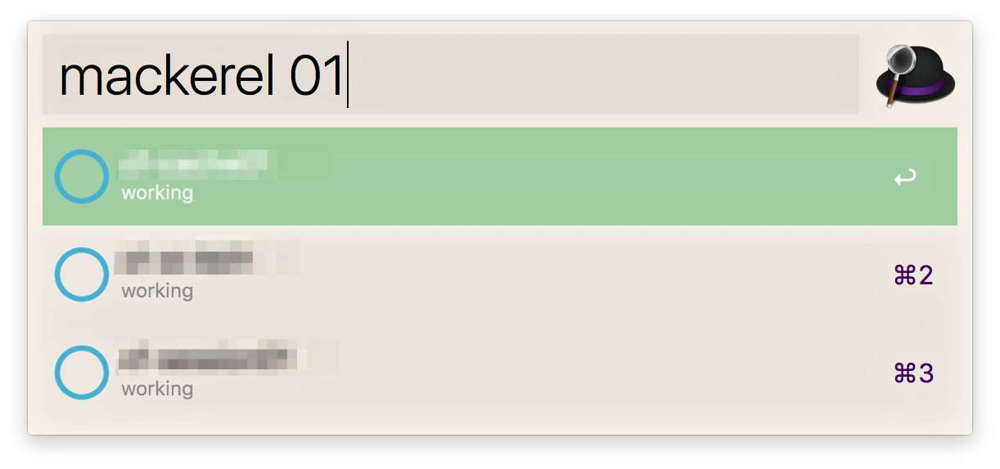

# Alfred Mackerel hosts Status Workflow

Search Mackerel hosts and show host's status.



## Install

Download and double-click.

- https://github.com/lorentzca/alfred-mackerel-hosts-status-workflow/releases/latest

## Usage

Register Mackcerel API Key.

- save to `apikey` file in workflow's data folder

```
mackerel api <XXXX>
```

Search and show hosts status.

```
mackerel <host name>
```
